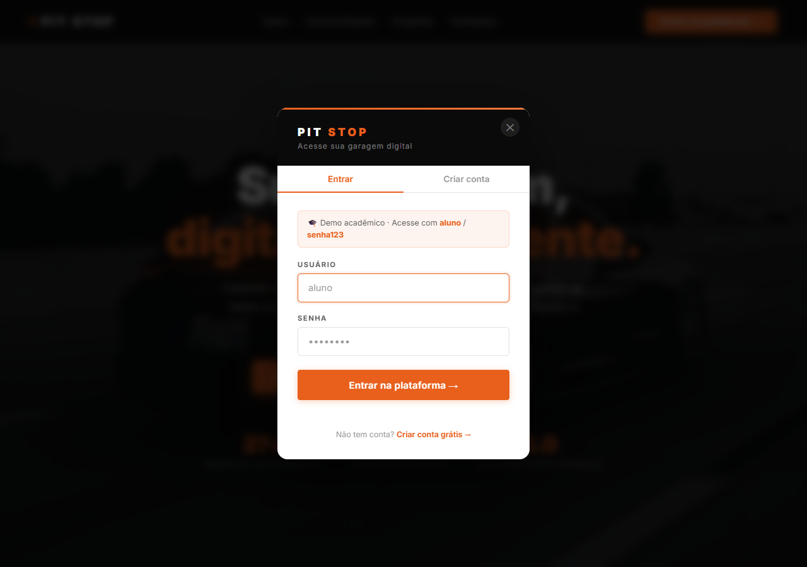
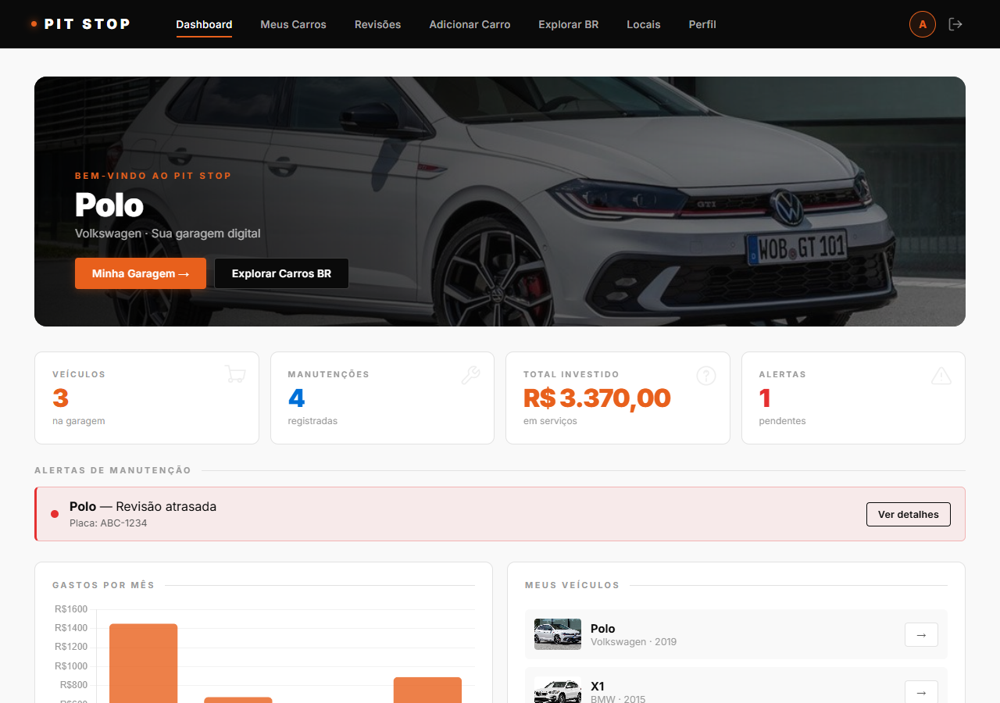
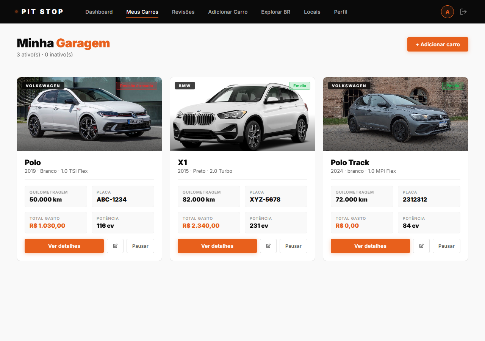

# Pit Stop — Gestão Automotiva


Plataforma web para gerenciamento de veículos, manutenções e revisões. Construída com Node.js + Express + EJS, banco SQLite, autenticação com bcrypt e proteção CSRF.

---

## Screenshots

| Home | Login |
|------|-------|
|  |  |

| Dashboard | Garagem |
|-----------|---------|
|  |  |

---

## Funcionalidades

- **Garagem digital** — cadastre veículos com dados do catálogo (27 modelos), fotos e KM atual
- **Histórico de manutenções** — tipo, oficina, custo, data, próxima revisão
- **Revisões com laudo** — checklist de 20 itens, número de documento único (`REV-YYYY-NNN`)
- **Dashboard** — gráfico de gastos, alertas de revisão atrasada, total investido
- **Alertas automáticos** — status por veículo (Em dia / Revisão próxima / Atrasada)
- **Perfil de usuário** — troca de senha, dados pessoais

---

## Stack

| Camada | Tecnologia |
|--------|-----------|
| Servidor | Node.js 18+ · Express 4 |
| Templates | EJS 5 |
| Banco de dados | SQLite via `better-sqlite3` |
| Autenticação | `express-session` + `better-sqlite3-session-store` + bcrypt |
| Segurança | Helmet · CSRF (Double Submit) · Rate limiting |
| Logs | Morgan |
| Upload | Multer (até 5 MB) |
| Testes | Jest + Supertest |

---

## Setup local

```bash
# 1. Clone o repositório
git clone https://github.com/Guxtavoo777/Pit-Stop-gestao-automotiva.git
cd Pit-Stop-gestao-automotiva

# 2. Instale as dependências
npm install

# 3. Configure o ambiente
cp .env.example .env
# Edite .env e defina SESSION_SECRET

# 4. Inicie o servidor
npm start
# ou em modo dev (hot-reload):
npm run dev
```

Acesse: `http://localhost:3000`

> **Conta de demonstração** (apenas ambiente local): `aluno` / `senha123`

Na primeira execução o banco `pitstop.db` é criado automaticamente com dados de demonstração.

---

## Variáveis de ambiente

| Variável | Obrigatória | Descrição |
|----------|-------------|-----------|
| `SESSION_SECRET` | **Sim em produção** | String aleatória longa para assinar sessões |
| `NODE_ENV` | Não | `development` (padrão) ou `production` |
| `PORT` | Não | Porta do servidor (padrão: 3000) |

---

## Testes

```bash
npm test
```

**44 testes** cobrindo:

| Grupo | O que é testado |
|-------|----------------|
| Autenticação | Login inválido (401/400), cadastro duplicado (409), logout |
| Rotas protegidas | Redirect/401 sem sessão para todas as rotas privadas |
| CRUD de Veículos | Criar, listar, atualizar, alternar status, excluir |
| Manutenções | Criar e excluir registros por veículo |
| Páginas EJS | Dashboard, perfil, 404 renderizam com status correto |
| `gastos()` | Soma de custos, tratamento de nulos |
| `situacao()` | `ok`, `aviso` (≤30 dias) e `critico` (atrasado), prioridade entre estados |

---

## Estrutura do projeto

```
pit-stop/
├── routes/
│   ├── auth.js          # Login, cadastro, logout
│   ├── veiculos.js      # CRUD de veículos + upload de foto
│   ├── manutencoes.js   # Registro e exclusão de manutenções
│   ├── revisoes.js      # CRUD de revisões com laudo
│   └── pages.js         # Rotas de renderização EJS + API de perfil
├── views/
│   ├── partials/        # head, topnav, scripts
│   └── *.ejs            # dashboard, garagem, veiculo, perfil…
├── public/
│   ├── style.css
│   ├── main.js          # Fetch interceptor CSRF, animações, toasts
│   └── uploads/         # Fotos enviadas pelo usuário
├── tests/
│   └── app.test.js
├── db.js                # Schema SQLite + migração + queries
├── server.js            # Express app, middleware, wiring
└── carros.js            # Catálogo de 27 modelos brasileiros
```

---

## Deploy (Railway)

O projeto inclui `Dockerfile` e `railway.json` prontos para uso:

1. Faça push do código para o GitHub
2. Crie um **novo projeto** em [railway.app](https://railway.app) → *Deploy from GitHub repo*
3. Selecione este repositório — Railway detecta o `Dockerfile` automaticamente
4. Em **Variables**, adicione:
   - `SESSION_SECRET` → string longa aleatória (ex.: resultado de `openssl rand -hex 32`)
   - `NODE_ENV` → `production`
5. Clique em **Deploy** — o app ficará disponível em `https://<projeto>.up.railway.app`

O endpoint `/health` é monitorado pelo Railway para verificar se o serviço está saudável.  
Na primeira inicialização o banco SQLite é criado automaticamente com o usuário demo `aluno / senha123`.

> **Persistência:** o SQLite é reiniciado a cada novo deploy. Para dados persistentes, configure um **Volume** Railway montado em `/app` ou migre para PostgreSQL.

---

## Segurança

- Senhas armazenadas com bcrypt (salt rounds 10)
- Migração transparente de senhas em texto plano para hash no próximo login
- Proteção CSRF via header `x-csrf-token` em todas as requisições de estado
- Rate limiting em rotas de autenticação (20 req / 15 min)
- Headers HTTP seguros via Helmet
- Sessões com `httpOnly`, `sameSite: lax`, `secure` em produção
- Extração explícita de campos no body (sem `...req.body` nas inserções)
